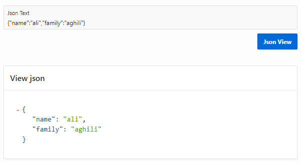

# Oracle Apex Json Viewer

<h2>very simple and lite.</h2>Cancel changes

<h4>How to use:</h4>
<ul>
  <li>1-import plugin in oracle apex</li>
  <li>2-add new PageItem in page</li>
  <li>3-select type "json_viewer[Plug-in]"</li>
</ul>

<h4>Demo:</h4>
<a href="https://apex.oracle.com/pls/apex/aak2020/r/test-plugin/frm-plugin-json-viewer?session=15554874389814" />

<h4>Preview:</h4>

